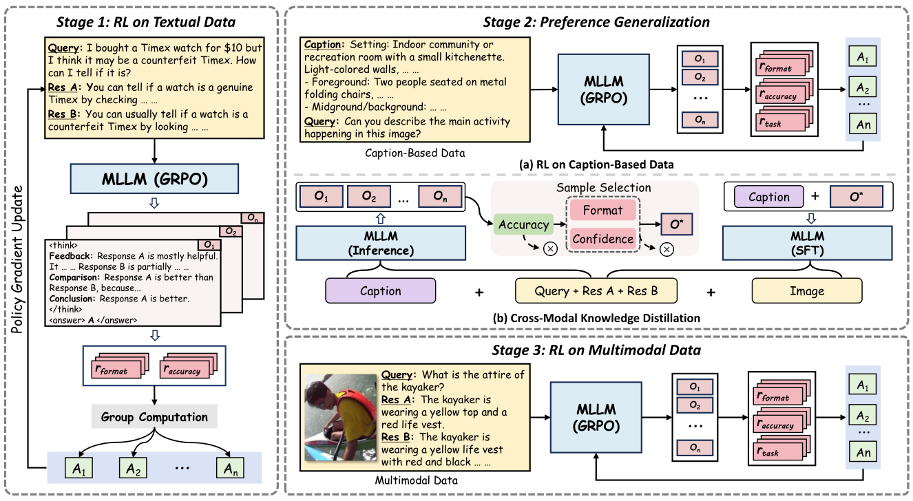

Official repository for **MSRL: Scaling Generative Multimodal Reward Modeling via Multi-Stage Reinforcement Learning**.

## 1. Introduction

MSRL addresses a central problem in multimodal alignment: **how to scale reinforcement learning for generative multimodal reward models (MRMs) when high-quality multimodal preference annotations are scarce and expensive to obtain**.

Recent progress in multimodal reward modeling has shifted from discriminative formulations to generative ones, and more recent studies have further introduced reinforcement learning with verifiable rewards (RLVR) to improve reward reasoning. Despite these advances, existing training pipelines still rely heavily on human-annotated multimodal preference data. Such a paradigm is costly, difficult to scale, and ultimately constrains the development of stronger multimodal reward models.

To overcome this limitation, the paper proposes **MSRL (Multi-Stage Reinforcement Learning)**. 



The key idea is not to depend on increasingly expensive multimodal annotations, but instead to:

1. learn general reward reasoning capabilities from large-scale **textual preference data**,
2. transfer these capabilities to multimodal settings through **caption-based preference transfer**, and
3. perform final adaptation with only a limited amount of **real multimodal preference data**.

In addition to staged reinforcement learning, the paper introduces **CMKD (Cross-Modal Knowledge Distillation)** to reduce the modality gap between textual inputs and genuine multimodal inputs, thereby enabling more stable transfer of reward reasoning across modalities.

## 2. Method Overview

MSRL consists of three stages.

### Stage 1: Text-Only Reward Reasoning

The first stage uses only textual preference data. The model is first trained with supervised fine-tuning (SFT) to produce well-structured reasoning traces, such as outputs containing `<think>` and `<answer>` tags. It is then optimized with RLVR on large-scale textual preference data to strengthen reward reasoning.

The objective of this stage is to obtain a **generalizable textual reward policy**. Since no image or video input is involved, the vision encoder and projector can remain frozen while the language-side reward reasoning capability is strengthened.

### Stage 2: Caption-Based Preference Transfer

The second stage uses **caption-based preference data** derived from multimodal preference samples. Specifically, the original image or video in each sample is replaced by its corresponding textual caption. As a result, supervision remains textual, while the semantics of the task become substantially closer to the target multimodal setting.

This stage serves as an intermediate bridge between text-only preference modeling and genuine multimodal preference modeling, thereby reducing the **task gap**. In this stage, the paper additionally introduces:

- **Task recognition reward**: the model is required to identify the task type, such as `image understanding`, `image generation`, `video understanding`, or `video generation`, before reward reasoning.
- **Experience replay**: a portion of high-quality textual preference samples from Stage 1 is mixed into each batch to mitigate catastrophic forgetting.
- **CMKD**: high-quality reasoning traces generated under caption conditions are distilled into multimodal inputs to improve cross-modal generalization.

### Stage 3: Multimodal RL Adaptation

The third stage performs reinforcement learning on a limited amount of real multimodal preference data, enabling the model to adapt to image understanding, image generation, video understanding, and video generation tasks.

Because the first two stages already provide strong reward reasoning capability and partial cross-modal transfer, this final stage no longer requires large-scale multimodal annotations to produce substantial gains. The paper reports consistent improvements on both visual understanding and visual generation benchmarks, for example:

- VL-RewardBench: `66.6% -> 75.9%`
- GenAI-Bench: `70.2% -> 75.7%`

## 3. Training Data Setup

The paper uses the following training scales:

- **Stage 1**
  - SFT: 40k rationale-based textual preference samples from [HelpSteer3](https://huggingface.co/datasets/nvidia/HelpSteer3)
  - RLVR: 400k textual preference samples sampled from [GRAM-RR-TrainingData](https://huggingface.co/datasets/wangclnlp/GRAM-RR-TrainingData)
- **Stage 2**
  - Caption-based preference data: `19,442` samples
- **Stage 3**
  - Multimodal preference data: `20,038` samples

Stages 2 and 3 cover four task categories:

| Task Type | Input Format | Description |
| --- | --- | --- |
| Image Understanding | Query + Image + Response A/B | Given an image and a textual query, determine which response is better. |
| Image Generation | Caption + Image A/B | Given a textual prompt, determine which generated image better matches the prompt. |
| Video Understanding | Query + Video + Response A/B | Given a video and a textual query, determine which response is better. |
| Video Generation | Caption + Video A/B | Given a textual prompt, determine which generated video better matches the prompt. |

## 4. Data Examples for MSRL

> **Important**
> The examples in this section are README-level illustrations for understanding the MSRL pipeline only. They may **not** be directly usable as input files for training or evaluation scripts.
> Since this project is built on top of `ms-swift`, the actual dataset files should follow the dataset schema expected by `ms-swift`. Please refer to the official documentation: [Custom Dataset - ms-swift](https://swift.readthedocs.io/en/latest/Customization/Custom-dataset.html).
> In other words, the JSON examples below are intended to explain the semantics of each stage, while the real runnable data files should be converted into the `ms-swift` format required by the corresponding script and reward plugin.

Below we provide README-level examples to illustrate the **data organization used in each stage**. These examples are simplified from the training templates described in the paper and are intended to clarify the overall pipeline.

### 4.1 Stage 1: Textual Preference Sample

This stage contains only textual input. The model compares two candidate responses for a user instruction and produces a preference judgment together with a reasoning trace.

```json
{
  "stage": "text_only_rl",
  "prompt": "Which response better answers the user's request?",
  "instruction": "Explain why regular exercise is important for mental health......",
  "response_a": "Regular exercise can reduce stress, improve mood, and support better sleep.",
  "response_b": "Exercise is good.",
  "chosen": "A"
}
```

The target output typically takes the following form:

```text
<think>
Response A is more complete, specific, and directly addresses mental health benefits.
</think>
<answer>
A
</answer>
```

This stage is designed to learn **general reward reasoning capability**, which serves as the foundation for subsequent multimodal transfer.

### 4.2 Stage 2: Caption-Based Preference Transfer Sample

In the second stage, the image or video in the original multimodal sample is replaced by a caption. The input therefore remains textual, while the task semantics become much closer to real visual preference modeling.

#### Example 1: Image Understanding -> Caption-Based

```json
{
  "stage": "caption_based_rl",
  "task_type": "image_understanding",
  "query": "What is the person doing in the scene?",
  "caption": "A man in a yellow raincoat is kayaking on rough water.",
  "response_a": "He is kayaking through moving water.",
  "response_b": "He is riding a bicycle in the city.",
  "chosen": "A"
}
```

#### Example 2: Image Generation -> Caption-Based

```json
{
  "stage": "caption_based_rl",
  "task_type": "image_generation",
  "prompt": "A futuristic city street at night with neon reflections after rain.",
  "image_a_caption": "A rainy cyberpunk street with neon lights reflected on the ground.",
  "image_b_caption": "A sunny village road with trees and bicycles.",
  "chosen": "A"
}
```

In this stage, the model is typically required to predict the task type first, for example:

```text
<type>image_generation</type>
```

It then generates `<think>` and `<answer>` outputs. This stage is primarily responsible for **bridging text-based preference reasoning and multimodal task-specific preference reasoning**.

### 4.3 Stage 3: Real Multimodal Preference Sample

The third stage uses real image or video inputs for reinforcement learning, allowing the model to perform preference judgment in actual multimodal scenarios.

#### Example 1: Image Understanding

```json
{
  "stage": "multimodal_rl",
  "task_type": "image_understanding",
  "query": "What is the attire of the kayaker?",
  "image": "assets/examples/kayaker.jpg",
  "response_a": "Yellow.",
  "response_b": "Black formal suit.",
  "chosen": "A"
}
```

#### Example 2: Image Generation

```json
{
  "stage": "multimodal_rl",
  "task_type": "image_generation",
  "prompt": "Generate an image of a ruined stone thoroughfare in epic fantasy style.",
  "image_a": "assets/examples/fantasy_road_a.png",
  "image_b": "assets/examples/fantasy_road_b.png",
  "chosen": "B"
}
```

#### Example 3: Video Understanding

```json
{
  "stage": "multimodal_rl",
  "task_type": "video_understanding",
  "query": "What are the performers doing in the video?",
  "video": "assets/examples/performance.mp4",
  "response_a": "They are moving in sync as part of a coordinated performance.",
  "response_b": "They are balancing on top of drums.",
  "chosen": "A"
}
```

#### Example 4: Video Generation

```json
{
  "stage": "multimodal_rl",
  "task_type": "video_generation",
  "prompt": "A jellyfish floating through a colorful coral reef.",
  "video_a": "assets/examples/jellyfish_a.mp4",
  "video_b": "assets/examples/jellyfish_b.mp4",
  "chosen": "A"
}
```

The goal of this stage is to complete the final **multimodal task adaptation**. Since the model has already acquired strong reward reasoning and cross-modal transfer ability in the previous stages, only a relatively small amount of real multimodal preference data is required to obtain clear gains.

## 5. Data Sources

According to the paper appendix, the multimodal data used in Stages 2 and 3 are mainly drawn from the following sources:

- `S1`: [vision-feedback-mix-binarized](https://huggingface.co/datasets/NiuTrans/vision-feedback-mix-binarized)
- `S2`: [open-image-preferences-v1](https://huggingface.co/datasets/data-is-better-together/open-image-preferences-v1)
- `S3`: [OpenAI-4o-human-preference](https://huggingface.co/datasets/Rapidata/OpenAI-4o_t2i_human_preference)
- `S4`: [ShareGPTVideo-DPO](https://huggingface.co/datasets/CodeGoat24/ShareGPTVideo-DPO)
- `S5`: [VideoDPO](https://huggingface.co/datasets/CodeGoat24/VideoDPO)
- `S6`: [text-2-video-human-preferences](https://huggingface.co/datasets/Rapidata/text-2-video-human-preferences)

More specifically:

- Stage 2 converts these multimodal samples into caption-based training instances.
- Stage 3 retains the original visual inputs and performs multimodal RL directly.

## 6. Installation

The current release is built on top of `ms-swift`. A typical environment can be prepared as follows:

```bash
conda create -n msrl python=3.10 -y
conda activate msrl

pip install --upgrade pip
pip install -e ".[eval]"

# RL and multimodal training dependencies
pip install deepspeed math_verify

# Optional but recommended for GRPO + fast rollout
pip install "vllm>=0.7.0"

# Optional acceleration libraries, install according to your CUDA environment
# pip install flash-attn --no-build-isolation
```

All training commands below assume Linux, CUDA GPUs, and a local checkout of this repository.

## 7. Training

### 7.1 Expected Data Files

The provided scripts assume the following local files:

```text
data/
├── stage1_sft.jsonl
├── stage1_rl.jsonl
├── stage2_caption_rl.jsonl
├── stage2_cmkd_sft.jsonl
├── stage3_multimodal_rl.jsonl
└── eval.jsonl
```

In practice, the fields used by the training scripts are:

- `messages`: standard `ms-swift` conversational input.
- `images` / `videos`: optional multimodal inputs for Stage 2 CMKD and Stage 3 RL.
- `solution` or `chosen`: the gold preference label, typically `A` or `B`.
- `task_type`: required for Stage 2 and Stage 3 if task recognition reward is enabled.

For GRPO-based stages, all extra dataset fields are passed to the custom reward plugin. The corresponding plugin in this repository is [scripts/msrl/msrl_grpo_plugin.py](/c:/Users/wangcl/Desktop/some_open_code/msrl/scripts/msrl/msrl_grpo_plugin.py), which currently defines:

- `msrl_accuracy_reward`
- `msrl_format_reward`
- `msrl_task_reward`

### 7.2 Stage 1: SFT on Textual Preference Data

Stage 1 SFT is used to teach the model the desired reasoning structure before reinforcement learning. The script is:

- [scripts/msrl/train_stage1_sft.sh](/c:/Users/wangcl/Desktop/some_open_code/msrl/scripts/msrl/train_stage1_sft.sh)

Example:

```bash
bash scripts/msrl/train_stage1_sft.sh
```

Key environment variables:

- `MODEL`: base checkpoint, e.g. `OpenGVLab/InternVL3_5-8B`
- `MODEL_TYPE`: model type recognized by `ms-swift`
- `DATASET`: local JSONL file for Stage 1 SFT
- `OUTPUT_DIR`: output directory for the checkpoint

### 7.3 Stage 1: GRPO on Textual Preference Data

After SFT, the textual reward policy can be strengthened with GRPO:

- [scripts/msrl/train_stage1_grpo.sh](/c:/Users/wangcl/Desktop/some_open_code/msrl/scripts/msrl/train_stage1_grpo.sh)

Example:

```bash
MODEL=output/msrl/stage1_sft \
DATASET=data/stage1_rl.jsonl \
bash scripts/msrl/train_stage1_grpo.sh
```

This stage freezes the vision encoder and projector, consistent with the text-only setting described in the paper.

### 7.4 Stage 2: Caption-Based RL

Caption-based preference transfer is implemented through:

- [scripts/msrl/train_stage2_caption_grpo.sh](/c:/Users/wangcl/Desktop/some_open_code/msrl/scripts/msrl/train_stage2_caption_grpo.sh)

Example:

```bash
MODEL=output/msrl/stage1_grpo \
DATASET=data/stage2_caption_rl.jsonl \
bash scripts/msrl/train_stage2_caption_grpo.sh
```

This script enables the task recognition reward and is intended for caption-only intermediate supervision. If experience replay is desired, the simplest approach is to materialize a mixed JSONL file that already contains both caption-based samples and replayed textual samples.

### 7.5 Stage 2: CMKD SFT

The CMKD stage aligns caption-induced reasoning with genuine multimodal inputs. The script is:

- [scripts/msrl/train_stage2_cmkd_sft.sh](/c:/Users/wangcl/Desktop/some_open_code/msrl/scripts/msrl/train_stage2_cmkd_sft.sh)

Example:

```bash
MODEL=output/msrl/stage2_caption_grpo \
DATASET=data/stage2_cmkd_sft.jsonl \
bash scripts/msrl/train_stage2_cmkd_sft.sh
```

This dataset should contain real multimodal inputs together with distilled teacher rationales as SFT targets.

### 7.6 Stage 3: Multimodal GRPO

The final multimodal adaptation stage is provided in:

- [scripts/msrl/train_stage3_multimodal_grpo.sh](/c:/Users/wangcl/Desktop/some_open_code/msrl/scripts/msrl/train_stage3_multimodal_grpo.sh)

Example:

```bash
MODEL=output/msrl/stage2_cmkd_sft \
DATASET=data/stage3_multimodal_rl.jsonl \
bash scripts/msrl/train_stage3_multimodal_grpo.sh
```

This stage unfreezes the visual modules and applies GRPO directly to genuine multimodal preference data.

## 8. Evaluation

This repository currently provides a lightweight native evaluation wrapper:

- [scripts/msrl/eval_native.sh](/c:/Users/wangcl/Desktop/some_open_code/msrl/scripts/msrl/eval_native.sh)

Example:

```bash
MODEL=output/msrl/stage3_multimodal_grpo \
EVAL_DATASET=data/eval.jsonl \
bash scripts/msrl/eval_native.sh
```

The evaluation script calls `swift eval` with the `Native` backend and is suitable for local JSONL datasets that follow the `ms-swift` format. In a typical setup, the evaluation dataset should contain:

- the same input structure as the corresponding training stage,
- ground-truth preference labels in fields such as `solution` or `chosen`,
- optional modality fields such as `images` or `videos`.

For benchmark-specific evaluation on datasets such as `VL-RewardBench`, `Multimodal RewardBench`, `GenAI-Bench`, `ShareGPTVideo`, or `VideoGen-RewardBench`, the recommended practice is to prepare benchmark-specific adapters that convert each benchmark into the `ms-swift` evaluation format and then invoke the same evaluation entry point.


### 9. Acknowledgments

We use [ms-swift](https://github.com/modelscope/ms-swift) as our codebase🌹🌹🌹.

We thank the following papers👍:
```
[1] Wang, Yibin, et al. "Unified reward model for multimodal understanding and generation." arXiv preprint arXiv:2503.05236 (2025).
[2] Wang, Chenglong, et al. "Rovrm: A robust visual reward model optimized via auxiliary textual preference data." Proceedings of the AAAI Conference on Artificial Intelligence. Vol. 39. No. 24. 2025.
[3] Chen, Xiusi, et al. "Rm-r1: Reward modeling as reasoning." arXiv preprint arXiv:2505.02387 (2025).
```


### 10. Citation
If you find our work helpful, please kindly cite us as:
```
@misc{wang2026msrl,
      title={MSRL: Scaling Generative Multimodal Reward Modeling via Multi-Stage Reinforcement Learning}, 
      author={Chenglong Wang and Yifu Huo and Yang Gan and Qiaozhi He and Qi Meng and Bei Li and Yan Wang and Junfu Liu and Tianhua Zhou and Jingbo Zhu and Tong Xiao},
      year={2026},
      eprint={2603.25108},
      archivePrefix={arXiv},
      primaryClass={cs.CV},
      url={https://arxiv.org/abs/2603.25108}, 
}
```
